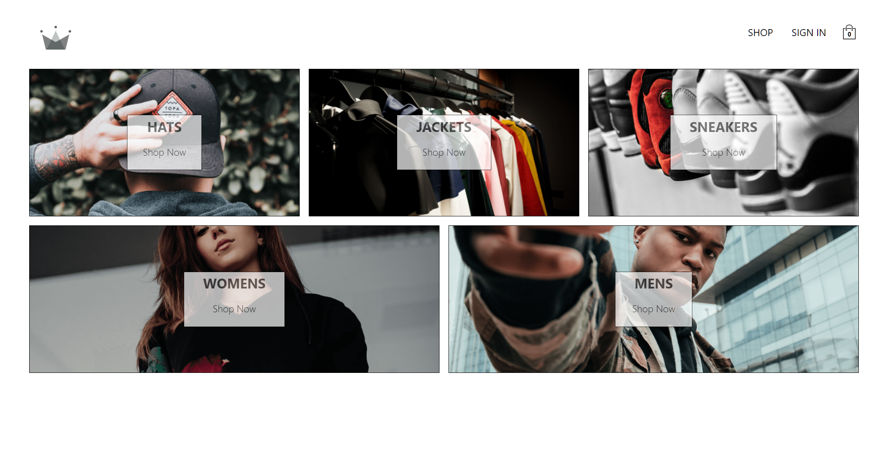
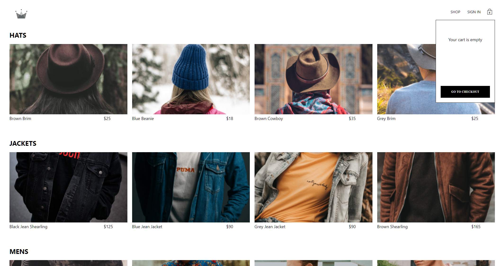
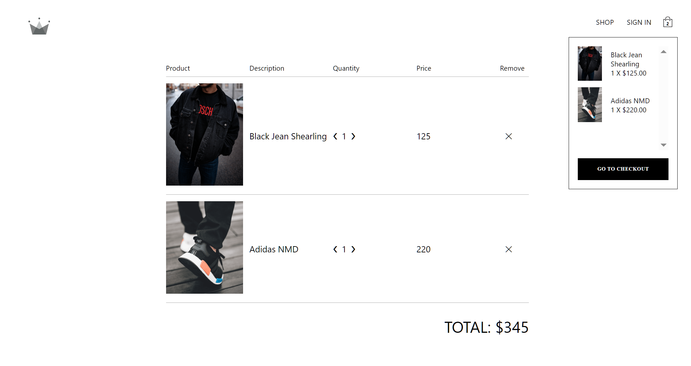
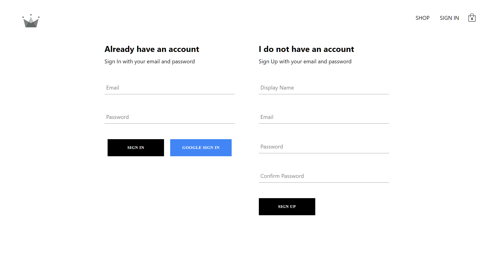

# [CrwnClothing](https://profound-chaja-258ec4.netlify.app/)

## Table of Contents

- [CrwnClothing](#crwnclothing)
  - [Table of Contents](#table-of-contents)
  - [Introduction](#introduction)
  - [What I Have Learned](#what-i-have-learned)
  - [Features](#features)
  - [Screenshoots](#screenshoots)
    - [Home Screen](#home-screen)
    - [Shop Screen](#shop-screen)
    - [Checkout Screen](#checkout-screen)
    - [Login Screen](#login-screen)
  - [Run App On Local Machine Using Available Scripts](#run-app-on-local-machine-using-available-scripts)

## Introduction

Crwn Clothing is a React e‑commerce prototype that showcases a modern clothing store with routed product pages, cart management. It was built with React in the frontend and Firebase in the backend, implementing CRUD operations for user authentication and authorization.

## What I have learned

- CRUD Operations: Properly managing products data in the cart component and checkout page.
- Frontend Technologies: Built using React with styled components, filtering, and routing.
- Authentication & Authorization: Secure user access, including login and registration using Firebase.
- Development Tools: Used Redux for state management and SASS for styling app.

## Features

- Signin functionality
- Signup functionality
- Routing functionality
- Add to Cart functionality

## Screenshoots

### Home Screen

### Shop Screen

### Checkout Screen

### Login Screen

## Run App On Local Machine Using Available Scripts

In the project directory from package.json, you can run:

### `npm start`

Runs the app in the development mode.\
Open [http://localhost:3000](http://localhost:3000) to view it in the browser.

The page will reload if you make edits.\
You will also see any lint errors in the console.

### `npm run build`

Builds the app for production to the `build` folder.\
It correctly bundles React in production mode and optimizes the build for the best performance.

The build is minified and the filenames include the hashes.\
Your app is ready to be deployed!

See the section about [deployment](https://facebook.github.io/create-react-app/docs/deployment) for more information.
